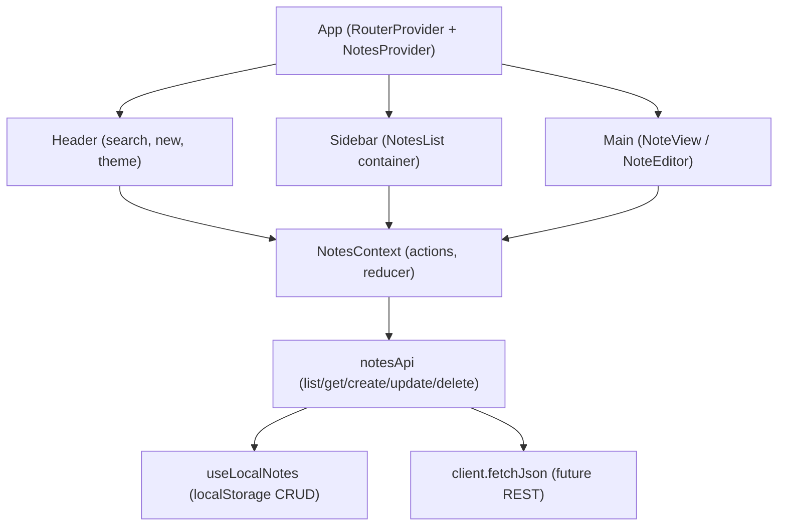

# Notes Frontend (Ocean Professional)

This is a lightweight React notes application with a modern “Ocean Professional” theme. It supports creating, viewing, editing, deleting, and searching notes with a localStorage-backed data layer and an internal hash-based router. No external dependencies beyond React and react-scripts are required.

## Overview

The app provides a focused notes experience with a responsive layout: a header with app title and search, a sidebar with the notes list, and a main content area for reading and editing. All data is stored locally in the browser via localStorage (with an in-memory fallback). The code is structured into components, a context store for state management, hooks for local storage operations, a small API layer abstraction, and minimal internal routing using the URL hash.

## Features

- Create, view, edit, and delete notes
- Global search across note titles and content
- Keyboard shortcuts for save (Ctrl/Cmd+S) when editing
- Accessible controls with proper roles, labels, focus rings, and live regions
- Responsive layout with a collapsible sidebar on small screens
- Light/Dark theme toggle using CSS variables
- Local persistence using localStorage with a safe in-memory fallback
- Internal hash-based routing with deep-linking to notes
- No external UI libraries; minimal dependencies

## Architecture

The application is organized by feature and responsibility:

- Components: UI building blocks for layout, common elements, and notes features
  - components/Layout: Header and Sidebar containers
  - components/Common: reusable UI helpers (EmptyState, SearchBar, InlineError, Spinner, Skeleton)
  - components/Notes: NotesList, NoteItem, NoteView, and NoteEditor
- Context Store:
  - src/context/NotesContext.js centralizes app state: notesById, order, selectedNoteId, loading, error, and query. Components interact with state via exposed actions and reducer.
- Hooks:
  - src/hooks/useLocalNotes.js provides Promise-based CRUD over localStorage. It returns “async-like” results to keep the API layer swappable for a real backend later.
- API Layer:
  - src/api/notesApi.js exposes listNotes, getNote, createNote, updateNote, deleteNote. Today it delegates to useLocalNotes. Later, it can switch to REST via fetchJson without changing consumers.
  - src/api/client.js defines error normalization and a fetchJson helper placeholder for future remote mode.
- Routing:
  - src/routes/AppRouter.js contains a minimal hash router and RouterProvider. Components are router-agnostic; App coordinates selection with the URL hash.
- Utilities:
  - src/utils/id.js generates note IDs
  - src/utils/storage.js provides namespaced localStorage management with an in-memory fallback
- Styles:
  - src/styles/theme.css defines the Ocean Professional theme tokens, utilities, and layout styles

## Getting Started (Preview system on port 3000)

Prerequisites:
- Node.js (LTS recommended)

Steps:
1. Change directory to notes_frontend:
   - cd note-keeper-29152-29197/notes_frontend
2. Install dependencies:
   - npm install
3. Start the development server:
   - npm start
4. Open the app in your browser:
   - http://localhost:3000

The app runs with Create React App’s dev server and automatically reloads on code changes.

## Styling & Theme (Ocean Professional)

The Ocean Professional theme is implemented using CSS variables in src/styles/theme.css. The color system emphasizes a blue primary (#2563EB), amber accents, and neutral grays for surfaces and text. Rounded corners, subtle shadows, and smooth transitions create a modern, minimal aesthetic. Dark mode overrides are provided via the [data-theme="dark"] attribute on the document root.

Key areas:
- Theme tokens (colors, radii, shadows, spacing, typography)
- Accessibility-focused focus rings and reduced motion support
- App shell layout styles for header, sidebar, and main content panels
- Utility classes for buttons, inputs, cards, and skeleton loaders

To toggle themes, the application sets data-theme to “light” or “dark” on the documentElement. The header exposes a theme toggle button.

## State Management & Data Flow

Global state lives in NotesContext:
- notesById: map of note objects keyed by ID
- order: array of note IDs ordered by recency
- selectedNoteId: the currently selected note
- loading: boolean for async UI hints
- error: string for error banners
- query: global search text

The reducer handles INIT_LOAD, SELECT_NOTE, CREATE_NOTE, UPDATE_NOTE, DELETE_NOTE, SET_SEARCH_QUERY, SET_LOADING, and SET_ERROR.

Data sources:
- On startup, App requests notes via notesApi.listNotes() and dispatches INIT_LOAD.
- Creating, updating, and deleting notes call into notesApi functions, which update both local storage and the context store in an optimistic fashion.
- Search updates state.query; list filtering happens in components.

LocalStorage fallback:
- src/utils/storage.js abstracts localStorage with a safety check. If localStorage is not available, it falls back to an in-memory store to prevent runtime failures and keep the UI working.

## Routing

The app uses internal hash-based routing implemented in src/routes/AppRouter.js, with routes:
- #/ => home
- #/note/:id => selects the corresponding note

The RouterProvider synchronizes NotesContext.selectedNoteId with the URL hash and vice versa, enabling deep-linking to specific notes without adding external routing dependencies. Components do not directly depend on router APIs; App coordinates navigation by calling navigate("/note/:id").

## Accessibility

Accessibility is a first-class concern throughout the UI:
- Proper roles and aria-labels for header, search, list navigation, and main content
- Focus management: visible focus rings, focusable error banners, and preferred reduced motion
- Live regions: polite announcements for changes such as note creation
- Keyboard support:
  - NotesList supports arrow key navigation and Enter to open a selected note
  - NoteEditor supports Esc to cancel editing and Ctrl/Cmd+S to save via the global key handler
- Semantic elements for sections and articles with descriptive labels
- Form validation with role="alert" regions and descriptive associations via aria-describedby

## API & Backend Integration (how to switch to REST later)

Today, notesApi delegates to the local storage adapter (useLocalNotes). The client fetchJson in src/api/client.js is a placeholder that is intentionally disabled in local mode to prevent accidental network calls.

Future REST steps:
1. Introduce environment flags (see below) to control API mode.
2. In src/api/client.js, enable fetchJson to perform actual network requests to a REST API, normalizing errors via toAppError.
3. In src/api/notesApi.js, switch implementations to call fetchJson endpoints while preserving the current function signatures and return shapes to avoid changes to components or context consumers.
4. Optional: maintain a dual mode (mock/local vs. remote) to ease development and testing.

Because the notesApi signatures already return Promises and resemble CRUD endpoints, swapping to a real backend requires only internal changes in notesApi and client.

## Configuration & Environment variables

No environment variables are required today. To prepare for future API mode, you can use these placeholders:
- REACT_APP_API_BASE: the base URL for a future REST API (e.g., https://api.example.com)
- REACT_APP_USE_MOCKS: when "true", forces use of the local storage adapter; when "false", enables remote REST calls

Note: As of now, src/api/client.js has USE_LOCAL hardcoded to true. A future change can read REACT_APP_USE_MOCKS to toggle.

## Testing (future guidance)

Basic test scaffolding is present via Create React App:
- npm test runs the test runner in watch mode

Recommended future tests:
- Component tests for NotesList, NoteEditor, and NoteView (rendering, ARIA roles, interactions)
- Context reducer unit tests for NotesContext (create, update, delete flows)
- Integration tests simulating keyboard navigation and routing synchronization
- Storage utility tests to confirm localStorage fallback and JSON safety

## Folder Structure

- src/
  - App.js, App.css: application shell and root styles for demo utilities
  - index.js, index.css: React entrypoint and base CSS
  - styles/
    - theme.css: Ocean Professional theme tokens, utilities, and layout styles
  - context/
    - NotesContext.js: global state, reducer, actions, and hooks
  - hooks/
    - useLocalNotes.js: localStorage-backed CRUD utility returning Promises
  - api/
    - client.js: error normalization and placeholder fetchJson for future REST
    - notesApi.js: API surface for notes CRUD, currently delegates to useLocalNotes
  - routes/
    - AppRouter.js: internal hash router and RouterProvider
  - utils/
    - id.js: ID generation utilities
    - storage.js: safe namespaced localStorage wrapper with in-memory fallback
  - components/
    - Layout/
      - Header.js: app title, search, new note, theme toggle
      - Sidebar.js: notes navigation, responsive behavior
    - Common/
      - EmptyState.js, InlineError.js, InlineError.forward.js, SearchBar.js, Spinner.js, Skeleton.js
    - Notes/
      - NotesList.js, NoteItem.js, NoteView.js, NoteEditor.js

## Roadmap

Short term:
- Add unit and integration tests for key flows and accessibility assertions
- Improve keyboard navigation within the list and between panels
- Persist theme selection between sessions

Medium term:
- Introduce REACT_APP_USE_MOCKS and REACT_APP_API_BASE to enable a remote API
- Implement fetchJson and switch notesApi to support remote CRUD with graceful error handling
- Add basic markdown rendering and formatting tools for note content

Long term:
- Tagging and filters, multi-select operations
- Import/export notes as JSON or Markdown
- Cloud sync and authentication (when backend is available)
- Offline-first enhancements and conflict resolution strategies

## How to Run the App Quickly

- npm install
- npm start
- Visit http://localhost:3000

Notes are persisted locally in your browser. Clearing site data will remove them. The app automatically falls back to in-memory storage if localStorage is unavailable, ensuring a functional preview experience.

## Contribution

- Keep components router-agnostic and interact via context actions or props.
- Maintain accessibility and ARIA roles for every new UI control; provide keyboard support.
- Prefer small, composable components and keep styles within theme tokens.
- When adding API integration, do not change the public signatures of notesApi; swap internal implementations instead.

